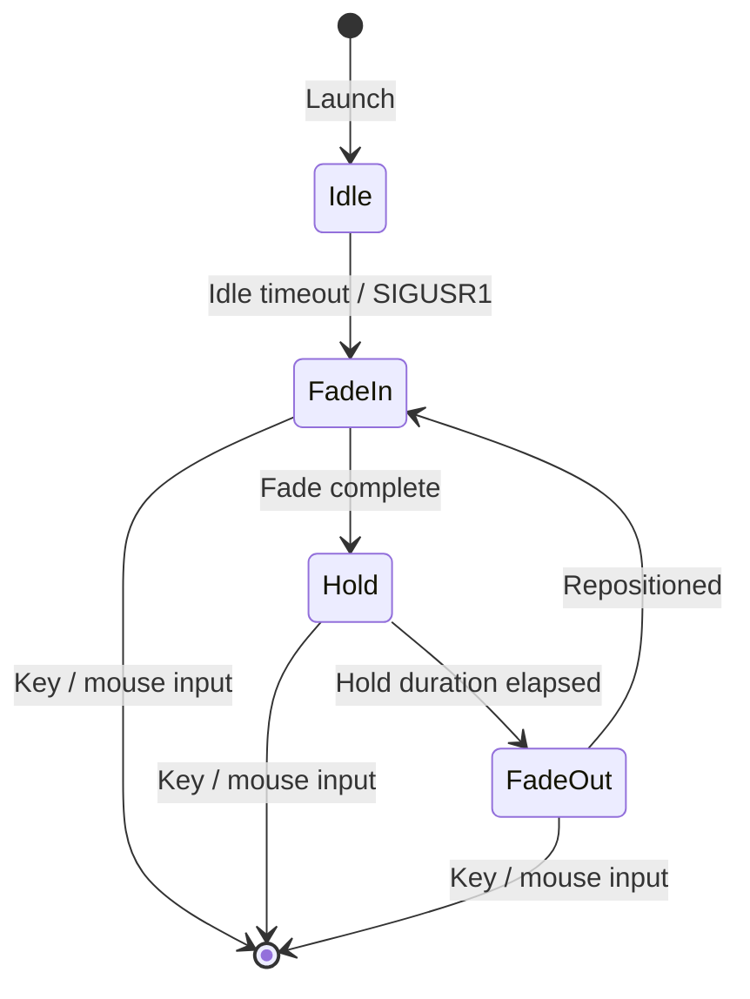

<div align="center">

# olsvr

**OLED screensaver for Wayland — fade-animated clock on pure black**

[](LICENSE)
[](https://www.rust-lang.org)
[](#)

</div>

---

olsvr prevents OLED burn-in by displaying a fading clock that periodically repositions itself on a pure black background. It activates after a configurable idle timeout, renders with GPU acceleration via wgpu, and dismisses on any keyboard or mouse input.


### Contents

- [Features](#features) · [Quick Start](#quick-start) · [Setup Wizard](#setup-wizard) · [Configuration](#configuration)
- [How It Works](#how-it-works) · [Requirements](#requirements) · [Contributing](#contributing)

---

## Features

- **Idle detection** — activates via `ext-idle-notify-v1` or D-Bus (GNOME) after configurable timeout
- **Fade animation** — clock fades in, holds, fades out, then teleports to a new position
- **Quadrant-aware repositioning** — never lands in the same screen quadrant twice in a row
- **Weather overlay** — colored Nerd Font weather icons with temperature and wind speed via [FMI Open Data](https://en.ilmatieteenlaitos.fi/open-data)
- **GPU-accelerated** — wgpu + glyphon text rendering on Vulkan
- **Configurable** — font, size, color, timing, date/time format via `~/.olsvr.toml`
- **Interactive setup wizard** — `olsvr setup` walks through configuration with live preview
- **systemd integration** — setup wizard can install and enable a user service
- **Manual trigger** — `olsvr run --activate` sends SIGUSR1 to a running instance
- **Idle inhibitor** — prevents the system from sleeping while the screensaver is active
- **Video-aware** — respects screensaver inhibitors (e.g. video playback) on both Wayland and D-Bus paths
- **Input dismissal** — any key press or mouse movement deactivates immediately

---

## Quick Start

```bash
# Build and install
cargo install --path .

# Run the setup wizard (first-run default)
olsvr setup

# Or run directly with defaults
olsvr run

# Trigger a running instance to show immediately
olsvr run --activate

# Preview the screensaver (shows instantly, dismiss with any input)
olsvr run --now

# Stop a running instance
olsvr stop
```

---

## Setup Wizard

Running `olsvr setup` (or just `olsvr` on first run) starts an interactive wizard that guides you through:

1. **Timing** — idle timeout, hold duration, fade speed
2. **Display** — font size, family, time/date format, brightness, padding
3. **Weather** — enable/disable weather overlay, location, icon font
4. **Preview** — launch a live preview to see your settings
5. **systemd** — optionally install as a user service that starts on login

The wizard writes `~/.olsvr.toml` and can be re-run at any time to adjust settings.

---

## Configuration

Settings live in `~/.olsvr.toml`. All fields are optional — defaults are used for anything omitted. The setup wizard (`olsvr setup`) is the easiest way to configure everything.

### Clock

| Field | Description | Default |
|---|---|---|
| `timeout` | Idle timeout in minutes | `5` |
| `hold` | Hold duration between fades (seconds) | `10` |
| `fade_duration` | Fade in/out duration (milliseconds) | `1500` |
| `font_size` | Clock font size (pixels) | `200` |
| `font_family` | Font family (`sans-serif`, `serif`, `monospace`, or a font name) | `sans-serif` |
| `time_format` | `24h` or `12h` | `24h` |
| `date_format` | [chrono format string](https://docs.rs/chrono/latest/chrono/format/strftime/) | `%a %d %b` |
| `color` | RGB brightness `[r, g, b]` | `[255, 255, 255]` |
| `edge_padding` | Minimum distance from screen edges (pixels) | `50` |

### Weather

The weather overlay shows a colored icon, temperature, and wind speed below the clock using [FMI Open Data](https://en.ilmatieteenlaitos.fi/open-data). Icons are Nerd Font weather glyphs — install a [Nerd Font](https://www.nerdfonts.com/) with weather icons (e.g. MesloLGS NF).

| Field | Description | Default |
|---|---|---|
| `location` | City name for FMI weather data | `helsinki` |
| `update_interval` | Weather fetch interval (seconds) | `600` |
| `font_size` | Weather text size (pixels) | `28` |
| `icon_font` | Nerd Font family for weather icons | `MesloLGS NF` |

### Example

```toml
timeout = 5

[[layers]]
type = "clock"
font_size = 200
font_family = "sans-serif"
time_format = "24h"
date_format = "%a %d %b"
color = [200, 200, 200]
hold = 10
fade_duration = 1500
edge_padding = 50

[[layers]]
type = "weather"
location = "helsinki"
update_interval = 600
font_size = 28
icon_font = "MesloLGS NF"
```

### CLI flags

CLI flags override config file values for the current run.

| Flag | Description |
|---|---|
| `--timeout <MINUTES>` | Idle timeout before activation |
| `--font-size <PIXELS>` | Clock font size |
| `--hold <SECONDS>` | Hold duration between fades |
| `--fade-duration <MS>` | Fade in/out duration |
| `--edge-padding <PIXELS>` | Minimum distance from screen edges |
| `--now` | Show immediately, skip idle wait |
| `--activate` | Send SIGUSR1 to a running instance |
| `--debug` | Show debug overlay (frame count, timing) |

---

## How It Works



The animation cycle runs continuously while the screensaver is active:

1. **Fade in** — clock appears at a random position, opacity rises from 0 to 255
2. **Hold** — clock stays visible at full brightness
3. **Fade out** — opacity drops back to 0
4. **Reposition** — clock teleports to a new quadrant (never the same one twice in a row)

The screensaver creates a fullscreen Wayland window with a pure black background. An idle inhibitor prevents the system from sleeping while active. Any keyboard or mouse input dismisses it immediately.

---

## Requirements

- **Wayland compositor** — GNOME, Sway, Hyprland, etc.
- **Rust toolchain** for building from source
- **GPU** with Vulkan support (wgpu backend)
- **libdbus** (for GNOME D-Bus fallback) — `libdbus-1-dev` on Debian/Ubuntu, `dbus-devel` on Fedora
- **Nerd Font** (optional, for weather icons) — install from [nerdfonts.com](https://www.nerdfonts.com/)

> Idle detection uses `ext-idle-notify-v1` (Sway, Hyprland) with automatic D-Bus fallback for GNOME/Mutter. Manual trigger is also available: `olsvr run --activate`

---

## Contributing

Contributions are welcome! Open an issue or submit a PR.

```bash
git clone https://github.com/laveez/olsvr.git
cd olsvr
git config core.hooksPath .githooks  # Enable pre-push fmt/clippy checks
cargo build
cargo run -- run --now               # Preview the screensaver
cargo run -- run --now --debug       # Preview with debug overlay
RUST_LOG=info cargo run -- run       # Run with logging
```

## License

[MIT](LICENSE)
